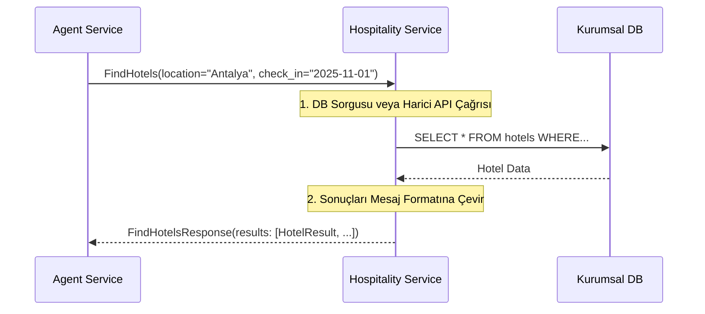

# 🏨 Sentiric Vertical Hospitality Service - Mantık ve Akış Mimarisi

**Stratejik Rol:** Konaklama ve otelcilik sektörüne özel iş mantığını (otel arama, rezervasyon yapma, oda durumu kontrolü) sunar. Agent'lar bu servisi, sektör dışı karmaşık mantıkla uğraşmadan kullanır.

---

## 1. Temel Akış: Otel Arama (FindHotels)

## 2. İş Mantığı Alanları

* Hotel Envanteri: Müsaitlik ve fiyat sorgulamaları.
* Rezervasyon Yönetimi: BookRoom RPC'si, harici sistemlere API çağrısı yaparak kesin rezervasyonu yönetir.
* Müşteri İlişkileri: Sadakat puanları, VIP statüsü gibi kullanıcı verilerini işlemek için user-service'e bağımlı olacaktır.